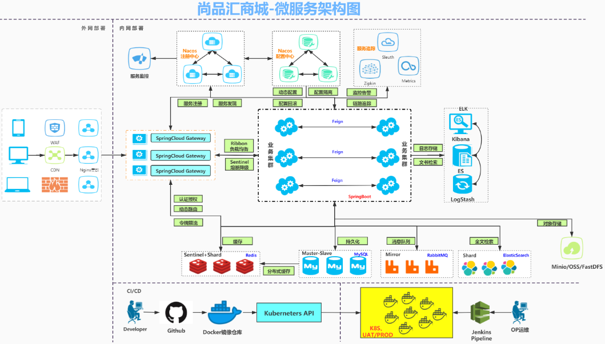
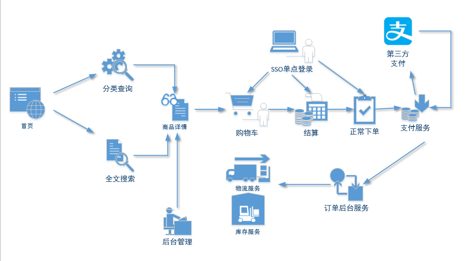
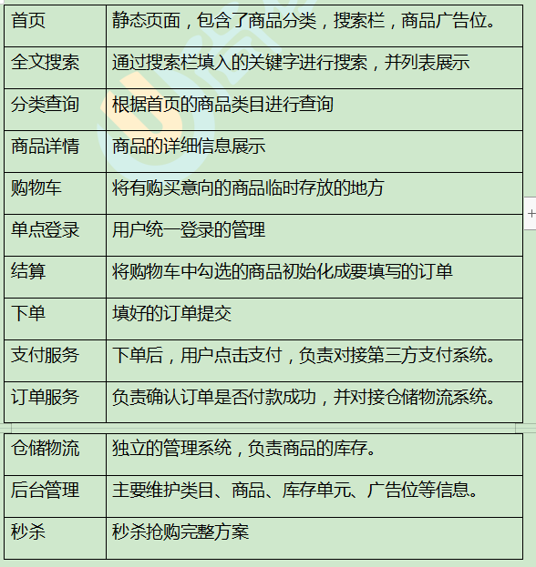

# 电商项目

# [B站尚硅谷官方学习视频链接](https://www.bilibili.com/video/BV1np4y1C7Yf?spm_id_from=333.999.0.0)

# 架构图

- **技术架构图**

  

  


* **业务流程图**

  

  


* **业务流程描述**

  




# 后端系统

## 组织结构

```
mall 
|__ mall-core 核心业务
	|__ mall-cart 购物车
	|__ mall-order 订单
	|__ mall-payment 支付
	|__ mall-product 商品
	|__ mall-search 搜索
	|__ mall-seckill 秒杀
	|__ mall_user 用户
|__ mall-utils -- 工具类
	|__ mall-common-utils 通用工具类
	|__ mall-core-utils 核心业务工具类
	|__ mall-web-utils web工具类
|__ mall-model 实体类
|__ mall-mbg mybatis_plus代码生成
|__ mall-gateway 网关
```


## 核心技术栈

| 技术                              | 说明                   | 官网                                            |
| --------------------------------- | ---------------------- | ----------------------------------------------- |
| SpringBoot 2.2.6.RELEASE          | 快速创建一个服务       | <https://spring.io/projects/spring-boot>        |
| SpringCloud Hoxton.SR8            | 微服务治理             | https://spring.io/projects/spring-cloud         |
| SpringCloud Alibaba 0.2.2.RELEASE | 微服务治理             | https://spring.io/projects/spring-cloud-alibaba |
| Mybatis-Plus 3.0.5                | 持久层框架和代码生成器 | https://baomidou.com/                           |
| Lombok                            | 简单实体类开发         | https://github.com/projectlombok/lombok         |
| Swagger2                          | 文档生成工具           | https://github.com/swagger-api/swagger-ui       |
| Logback                           | 日志系统               | http://logback.qos.ch/                          |
| Spring Data Redis                 | 缓冲层框架             | https://spring.io/projects/spring-data-redis    |
| FastDFS                           | 文件系统               | https://github.com/happyfish100/fastdfs         |


**2、数据库和中间件**

| 技术         | 说明         | 官网                      |
| ------------ | ------------ | ------------------------- |
| MySQL 5.7    | 关系型数据库 | https://www.mysql.com/    |
| Redis 5.0    | 缓存技术     | https://redis.io/         |
| RabbitMQ 3.8 | 消息中间件   | https://www.rabbitmq.com/ |